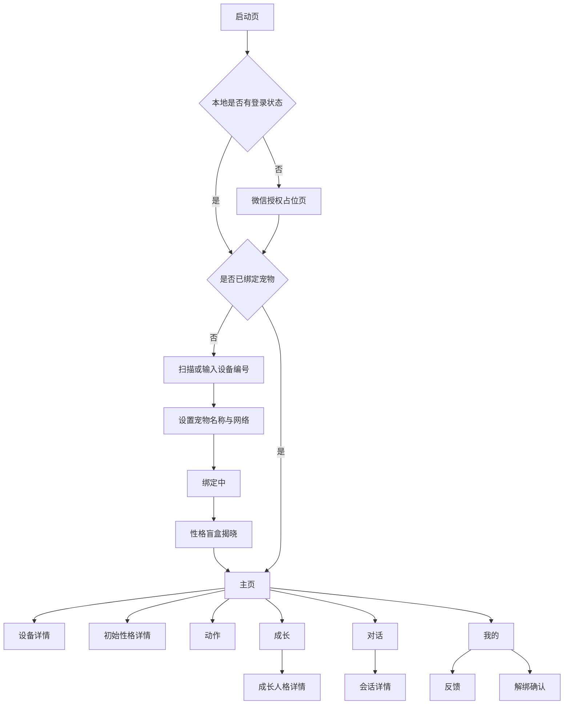

# AI 猫伴侣微信小程序 UI 第一阶段需求

> 版本：V1.0  
> 日期：2026-08-12  
> 负责人：Mars  
> 依据：当前 `ai-cat-controller` 网页版功能与视觉风格

## 1. 阶段目标

本阶段只完成微信小程序的页面结构、视觉排版、交互状态和本地 Mock 数据流，不连接
设备、FastAPI、火山引擎或正式微信用户体系。

完成后应得到一个可在微信开发者工具和手机预览中完整浏览的高保真小程序原型：

- 可以走完授权、设备绑定和首次性格盲盒流程；
- 可以查看主页、动作、亲密度、成长人格、对话历史和设置页面；
- 所有按钮具备加载、成功、失败、禁用、离线等界面状态；
- 页面只依赖统一的 `PetService` 接口，不直接读取 Mock 文件；
- 第二阶段接入云端 API 时，只替换 Service 实现和鉴权逻辑，不重写页面。

## 2. 本阶段不做

- 不直接连接当前 K1 局域网 IP；
- 不接入火山引擎、语音流、设备长连接或微信正式登录；
- 不发送真实动作、触摸、音量和解绑命令；
- 不实现真实 Wi-Fi 配网协议，只完成配网页面和状态展示；
- 不显示 API Key、Mock、SDK、调试模式、原始电机参数等开发信息；
- 不提供成长加速、模拟电量、模拟在线状态或一键清空全部数据；
- 不允许用户在性格盲盒完成后自行切换初始性格。

## 3. 相对网页版的结构调整

网页版的 7 个一级入口不直接复制到小程序。小程序底部导航固定为 5 项：

| Tab | 页面 | 对应网页版内容 |
|---|---|---|
| 主页 | `pages/home/index` | 宠物主页、连接状态、电量 |
| 动作 | `pages/motion/index` | 安全预设动作、动作记录 |
| 成长 | `pages/growth/index` | 亲密度、解锁、成长人格入口 |
| 对话 | `pages/dialog/index` | 语音状态、文字提问、会话列表 |
| 我的 | `pages/profile/index` | 宠物设置、反馈、解绑 |

以下内容改为二级页面或首次流程：

- 登录、绑定和性格盲盒：首次进入流程，不占 Tab；
- 设备连接详情：从主页状态区域进入；
- 成长人格：从成长页进入独立详情页；
- 会话详情：从会话列表进入独立详情页；
- 异常反馈：从“我的”进入独立表单页；
- 初始性格详情：从主页或成长页进入只读详情页。

这样处理的原因：移动端不适合桌面侧栏，也不适合在一个页面中使用会话列表和会话
详情双栏布局。一级导航必须保持稳定、易点按并符合用户日常使用频率。

## 4. 用户流程



## 5. 技术与目录要求

第一阶段推荐使用微信原生小程序、TypeScript、WXML 和 WXSS，不引入大型 UI 框架。
项目目录建议：

```text
miniprogram/
├── app.ts
├── app.json
├── app.wxss
├── sitemap.json
├── assets/
│   ├── images/ai-cat-avatar.png
│   └── icons/                    # 本地固定图标
├── components/
│   ├── app-page/
│   ├── pet-header/
│   ├── status-badge/
│   ├── metric-item/
│   ├── intimacy-progress/
│   ├── action-item/
│   ├── empty-state/
│   ├── loading-skeleton/
│   ├── record-disclosure/
│   └── confirm-sheet/
├── pages/
│   ├── auth/index
│   ├── bind/index
│   ├── blind-box/index
│   ├── home/index
│   ├── device/index
│   ├── motion/index
│   ├── growth/index
│   ├── growth-personality/index
│   ├── personality/index
│   ├── dialog/index
│   ├── conversation/index
│   ├── profile/index
│   └── feedback/index
├── services/
│   ├── pet-service.ts            # 页面依赖的唯一业务接口
│   ├── mock-pet-service.ts       # 第一阶段实现
│   └── api-pet-service.ts        # 第二阶段预留
├── mocks/
│   ├── pet.ts
│   ├── actions.ts
│   ├── growth.ts
│   └── conversations.ts
├── models/
│   ├── pet.ts
│   ├── motion.ts
│   ├── growth.ts
│   └── dialog.ts
├── store/
│   └── app-store.ts
└── utils/
    ├── request-id.ts
    ├── format.ts
    └── validators.ts
```

每个页面使用独立的 `.ts/.json/.wxml/.wxss` 文件。不得在 WXML 中放复杂业务判断，
不得让页面直接 `import mocks/*`。

## 6. 视觉规范

### 6.1 设计方向

延续网页版的白色与暖黄色搭配，整体安静、友好、适合长期使用。界面是宠物陪伴
产品，不使用后台管理系统或营销落地页的视觉结构。

- 页面背景：`#F6F7F3`；
- 主内容背景：`#FFFFFF`；
- 主色：`#956707`；
- 主色浅底：`#FFF1B8`；
- 强调黄：`#D9A827`；
- 主文字：`#20231F`；
- 次文字：`#687069`；
- 分隔线：`#DFE4DD`；
- 成功：`#2D7558`，浅底 `#E5F2EB`；
- 信息：`#326B7C`，浅底 `#E8F2F5`；
- 警告/危险：`#B54D3E`，浅底 `#FAEBE8`。

禁止渐变、装饰光球、大面积深色背景和单一黄色铺满页面。黄色只用于主要按钮、
选中状态、亲密度进度和重要提示；在线、电量、异常等状态继续使用绿、蓝、红区分。

### 6.2 尺寸与排版

- 设计基准宽度：`750rpx`；
- 页面左右留白：`32rpx`；
- 区块纵向间距：`32rpx`；
- 区块内边距：`28rpx`；
- 小间距：`12rpx`，常规间距：`20rpx`；
- 卡片圆角最大 `16rpx`，按钮圆角 `10rpx`；
- 页面标题：`40rpx/1.3`，区块标题：`30rpx/1.4`；
- 正文：`28rpx/1.55`，辅助信息：`24rpx/1.45`；
- 触控区域高度不得低于 `88rpx`；
- 底部固定区域必须包含 `safe-area-inset-bottom`；
- 禁止使用随屏幕宽度连续缩放的字号；
- 长名称最多两行，编号和数值使用等宽数字效果，不能撑破容器。

重复项目可以使用卡片，页面区块本身保持无外浮卡片的连续布局。不得出现卡片嵌套
卡片。动作项、会话项和指标项必须有稳定高度，加载和状态变化不能引起明显跳动。

### 6.3 图片和图标

- 使用网页版的米色布偶猫形象，源文件：
  `src/ai_cat_controller/static/ai-cat-avatar.png`；
- 小程序内另存一份裁剪后的正方形 PNG，建议 `512×512` 且不超过 `300 KB`；
- 主页首屏必须清楚展示猫咪，不使用模糊背景图；
- 导航与按钮图标采用同一套 Lucide 风格本地图标，不使用 `◎`、`⌂`、`↔` 等文本
  字符代替图标；
- 图标按钮必须有可读的 `aria-label` 或邻近文字说明；
- Tab 图标建议：`house`、`move`、`sprout`、`message-circle`、`user-round`。

## 7. 公共页面状态

所有页面都必须实现以下状态，不允许只制作正常态截图：

| 状态 | 表现 |
|---|---|
| 首次加载 | 固定尺寸骨架屏，保留最终布局高度 |
| 下拉刷新 | 使用页面原生下拉刷新，不重复叠加全屏 Loading |
| 空数据 | 图标、简短说明和一个明确操作，不显示技术错误 |
| 请求失败 | 保留上次成功数据，顶部轻提示并提供重试 |
| 未登录 | 返回授权页 |
| 未绑定 | 返回绑定流程 |
| 离线 | 顶部显示“暂时离线”，动作按钮禁用，历史仍可查看 |
| 弱网 | 显示“连接不稳定”，避免连续重复提交 |
| 提交中 | 按钮显示进度且禁止重复点击 |
| 成功 | 轻提示并局部刷新，不整页闪烁 |
| 业务冲突 | 显示用户可理解的原因，例如“正在执行其他动作” |

## 8. 页面详细要求

### 8.1 授权页 `pages/auth/index`

首屏上半部展示猫咪图片、产品名“AI 猫伴侣”和一句简短说明。下半部只保留一个
“微信快捷登录”主按钮及隐私协议勾选项。

第一阶段按钮写入本地 Mock 登录状态。不得出现账号标识、用户昵称输入框或 API
Key。昵称和头像后续通过微信合规授权流程获得。

### 8.2 设备绑定页 `pages/bind/index`

页面分三步，用顶部步骤指示器展示当前进度：

1. 识别设备：主按钮“扫描设备二维码”，次入口“手动输入设备编号”；
2. 设置资料：宠物名称、当前网络名称和连接状态；
3. 确认绑定：展示猫咪图片、设备编号后四位和宠物名称。

绑定按钮提交后展示不可重复点击的进度页。Mock 模式延迟 `800–1200ms` 返回结果，
以便验收加载态。输入校验沿用当前后端约束：宠物名 `1..20` 字符、设备编号
`4..64` 字符、网络名称 `1..64` 字符。

真实配网协议尚未确定，因此本阶段不得用“已完成配网”的假状态误导用户。可以显示
“连接方式将在设备接入阶段启用”。

### 8.3 性格盲盒页 `pages/blind-box/index`

这是首次绑定后的一次性结果页，不使用可以反复抽取的转盘或“再抽一次”按钮。

- 猫咪图片占首屏约 `40%` 高度；
- 展示“它的初始性格是”、性格名称、描述和语言风格；
- 主按钮文案为“认识它”；
- 页面返回手势在确认前禁用或弹出确认；
- 确认后进入主页，后续只可从性格详情查看，不能重新抽取。

Mock 数据必须覆盖 5 种结果：元气探险家、温柔陪伴者、傲娇小明星、好奇小博士、
沉稳守护者。测试入口可以通过开发工具配置固定结果，但用户页面不显示选择器。

### 8.4 主页 `pages/home/index`

主页首屏按以下顺序排列：

1. 宠物概览：猫咪图片、名称、在线状态、初始性格名称；
2. 亲密度条：当前分值、等级名称、距离下一等级的进度；
3. 三项状态：电量、充电状态、网络状态；
4. 今日陪伴摘要：今日互动次数、最近一次互动；
5. 当前称呼：“现在它会称呼你：亲爱的朋友”；
6. 最近动态：最多 3 条动作、对话或成长事件。

电量不可用时显示“暂未获取”，不能用 `0%` 代替。充电器在线和正在充电是两个
不同状态。点击状态区域进入设备详情，点击性格进入初始性格详情，点击亲密度进入
成长 Tab。

### 8.5 设备详情 `pages/device/index`

展示设备编号（中间字符脱敏）、网络、最近在线、电量、电池状态、充电状态和连接
提示。离线时提供“重新连接”按钮，但第一阶段只模拟状态变化。

页面文案面向普通用户，不出现进程、服务名、Linux、适配器模式、GPIO 或状态文件。

### 8.6 动作页 `pages/motion/index`

顶部显示当前动作状态。执行中时展示动作名称、进度动画和红色“停止”图标按钮；
空闲时不占用额外大块空间。

动作使用两列稳定高度卡片，窄屏仍保持两列，名称过长时换行但卡片等高。每项包含：

- 动作图标、动作名称、动作编号；
- 一句用户能理解的描述；
- `可执行 / 执行中 / Lv.N 解锁 / 暂不可用` 状态；
- 整张卡片可点击，执行中禁止其他动作。

首版动作共 7 个：轻轻摇头、认真点头、开心摇尾、骄傲转身、安静陪伴、见面问候、
升级庆祝。小程序不得显示或提交方向、角度、速度、持续时间等底层参数。

底部“最近动作”默认折叠，展开后展示最近 20 条及状态。动作请求必须在客户端生成
稳定 `request_id`，重试复用同一个 ID。

### 8.7 成长页 `pages/growth/index`

页面上半部为亲密度主视觉：等级名称、徽章、当前分值、下一等级分值、进度条和
每日增长说明。

“今日互动”改为用户态展示，不照搬网页版调试按钮：

- 每日见面：自动登记，显示“今日已见面”；
- 有效对话：显示今日完成次数；
- 触摸反馈：由设备事件产生，只显示次数，不提供虚拟“摸摸它”按钮；
- 一起完成任务：保留用户确认入口，后续接入正式任务证明机制；
- “错过问候”属于系统规则，不作为用户主动扣分按钮。

其后依次为：已解锁能力、下一等级预告、成长人格摘要入口、最近互动折叠区。升级时
显示一次轻量庆祝弹层，但不在客户端自行判定或发送庆祝动作；以服务端升级事件为准。

### 8.8 成长人格页 `pages/growth-personality/index`

独立页面展示长期成长，不与初始性格混为一个概念：

- 顶部说明“初始性格不会改变，长期互动会丰富表达与行为倾向”；
- 成长标签使用可换行标签组；
- 六维倾向逐项显示名称、精确数值、五段刻度和倾向等级；
- 六维顺序固定：好奇、共情、求知、活力、淘气、自律；
- 当前行为画像使用无边框列表；
- 最近成长默认折叠，展开后显示原因、时间和数值变化。

没有标签时显示“相处还在慢慢积累”，不显示错误或全零诊断信息。用户版不包含成长
加速或批量生成事件表单。

### 8.9 初始性格详情 `pages/personality/index`

只读展示性格名称、描述、语言风格、当前称呼、偏好的日常动作和不同亲密度阶段的
关系变化。音色由服务端统一配置，不显示音色切换控件。

页面底部明确说明“初始性格在首次绑定时确定，会随宠物保存”。不得提供重抽、编辑
提示词或切换性格功能。

### 8.10 对话页 `pages/dialog/index`

移动端不使用网页版左右双栏。页面结构：

1. 紧凑状态栏：等待唤醒、正在聆听、正在思考、正在回答、等待追问、暂时离线；
2. 与状态匹配的主操作：开始聆听或继续聆听；
3. 回答中显示“打断并结束”按钮；
4. 文字输入框固定在 Tab 内容底部，支持 `1..500` 字；
5. 下方或中部展示按时间倒序的会话列表。

状态必须同时使用图标、文字和颜色，不能只用颜色区分。思考和回答状态使用低强度
动画，离开页面后停止无意义动画。文字发送后立即在本地显示待发送消息，失败时显示
“重新发送”，同一次重试复用 `request_id`。

会话项包含开始时间、用户问题摘要、回答摘要、消息数和状态。点击进入会话详情。
列表支持下拉刷新和触底加载，不每秒全量刷新；第二阶段根据服务端 revision 增量同步。

### 8.11 会话详情 `pages/conversation/index`

消息按时间正序排列。用户消息右对齐、暖黄色背景；宠物消息左对齐、白色或浅绿背景。
同一角色连续消息减少重复头像。页面顶部展示时间、持续时长和会话状态。

等待回答时保留固定高度占位和“正在思考”状态，避免消息列表跳动。长文本可选择，
但不提供编辑、删除或伪造历史功能。

### 8.12 我的 `pages/profile/index`

顶部展示微信用户摘要和当前宠物。设置按列表分组：

- 宠物名称；
- 音量 `0..100`；
- 连续聊天时间 `5..120` 秒，步长 5 秒；
- 设备信息；
- 问题反馈；
- 隐私与用户协议；
- 解除绑定。

音量拖动时只更新本地数值，松手后的 `change` 事件再提交，避免滑条跳变和高频请求。
页面不得出现 API Key。解除绑定使用底部确认面板，明确说明性格和成长跟随宠物保留，
原用户历史不会交给新用户。

“重置全部数据”只属于内部演示工具，不进入正式小程序用户界面。

### 8.13 反馈页 `pages/feedback/index`

问题类型为设备、对话、动作、账号和其他；描述 `2..500` 字，显示剩余字数。支持
补充最多 3 张图片的界面占位，但第一阶段不上传。提交成功后返回“我的”并显示成功
提示，提交中禁止重复点击。

## 9. 公共组件要求

| 组件 | 职责 |
|---|---|
| `app-page` | 统一页面留白、加载、错误和安全区 |
| `pet-header` | 猫咪头像、名称、性格和在线状态 |
| `status-badge` | 在线、弱网、离线、执行状态；图标与文字并用 |
| `metric-item` | 电量、网络、亲密度等稳定尺寸指标 |
| `intimacy-progress` | 分值、等级、进度和下一等级 |
| `action-item` | 动作固定卡片、锁定和执行状态 |
| `record-disclosure` | 最近互动、动作和成长记录折叠区 |
| `empty-state` | 统一空状态，支持一个主操作 |
| `loading-skeleton` | 与最终内容同尺寸的加载骨架 |
| `confirm-sheet` | 停止动作、解绑等高风险确认 |

组件不得读取全局网络数据；数据和事件通过 properties 与自定义事件传递。

## 10. 第一阶段 Mock 数据模型

页面只使用下列面向 UI 的模型。字段命名尽量与当前 FastAPI 数据接近，但不要让页面
依赖后端响应包裹结构。

```ts
type ConnectionState = "online" | "weak" | "offline";
type BatteryState =
  | "charging"
  | "discharging"
  | "full"
  | "not_charging"
  | "unknown"
  | "unavailable";

interface PetSummary {
  petId: string;
  deviceId: string;
  serialMasked: string;
  name: string;
  avatarUrl: string;
  personalityId: string;
  personalityName: string;
  personalityDescription: string;
  languageStyle: string;
  address: string;
  connectionState: ConnectionState;
  networkName: string;
  lastSeenAt: string | null;
  batteryPercent: number | null;
  batteryState: BatteryState;
  chargerOnline: boolean | null;
}

interface IntimacyState {
  points: number;
  level: number;
  levelName: string;
  badge: string;
  levelStart: number;
  nextLevelPoints: number | null;
  progressPercent: number;
  dailyGrowth: number;
  dailyCap: number;
  currentUnlocks: string[];
  nextUnlocks: string[];
}

type ActionState = "available" | "locked" | "unavailable" | "running";

interface PetAction {
  actionId: string;
  actionNo: number;
  name: string;
  description: string;
  minLevel: number;
  state: ActionState;
  unavailableReason?: string;
}

interface GrowthAttribute {
  id: "curiosity" | "empathy" | "knowledge" | "energy" | "mischief" | "discipline";
  name: string;
  value: number;
  band: "普通" | "初显" | "成长中" | "明显" | "突出";
}

interface ConversationSummary {
  conversationId: string;
  status: "complete" | "waiting_assistant" | "assistant_only";
  startedAt: string;
  updatedAt: string;
  messageCount: number;
  userPreview: string | null;
  assistantPreview: string | null;
}

interface DialogMessage {
  messageId: string;
  role: "user" | "assistant";
  content: string;
  createdAt: string;
  deliveryState?: "sending" | "sent" | "failed";
}
```

Mock 数据至少准备以下场景，并可从开发配置切换：

1. 未登录；
2. 已登录未绑定；
3. 首次绑定待揭晓性格；
4. 在线、电量充足、Lv.2；
5. 弱网、正在充电；
6. 离线、电量不可用；
7. 动作执行中和动作锁定；
8. 即将升级与升级成功；
9. 无成长标签与多个成长标签；
10. 空会话、等待回答、完整会话和发送失败。

## 11. Service 抽象

页面只调用以下业务接口。第一阶段由 `MockPetService` 实现；第二阶段由
`ApiPetService` 映射云端响应。

```ts
interface PetService {
  login(): Promise<UserSession>;
  getBoundPet(): Promise<PetSummary | null>;
  bindPet(input: BindPetInput): Promise<BindResult>;
  getDashboard(petId: string): Promise<DashboardView>;
  getDeviceDetail(petId: string): Promise<DeviceDetail>;
  reconnectDevice(petId: string): Promise<void>;

  getActions(petId: string): Promise<PetAction[]>;
  executeAction(petId: string, actionId: string, requestId: string): Promise<ActionExecution>;
  stopAction(petId: string, requestId: string): Promise<void>;
  getActionHistory(petId: string): Promise<ActionExecution[]>;

  getIntimacy(petId: string): Promise<IntimacyView>;
  completeTask(petId: string, requestId: string): Promise<InteractionResult>;
  getGrowth(petId: string): Promise<GrowthView>;

  getDialogStatus(petId: string): Promise<DialogStatus>;
  startListening(petId: string, requestId: string): Promise<void>;
  interruptDialog(petId: string, requestId: string): Promise<void>;
  sendText(petId: string, content: string, requestId: string): Promise<void>;
  listConversations(petId: string, cursor?: string): Promise<ConversationPage>;
  getConversation(petId: string, conversationId: string): Promise<ConversationDetail>;

  updatePet(petId: string, input: UpdatePetInput): Promise<PetSummary>;
  updateFollowUpSeconds(seconds: number): Promise<void>;
  submitFeedback(petId: string, input: FeedbackInput): Promise<void>;
  unbindPet(petId: string): Promise<void>;
}
```

所有写操作都要支持客户端生成的 `request_id`。Service 负责把服务端错误转换为统一
的用户错误类型，页面不能解析 HTTP 状态码或后端 `details`。

## 12. 后续接口移植边界

第二阶段接入时采用“小程序 → 云端服务 → 设备”的正式链路。小程序不保存设备密钥，
不硬编码 K1 IP，不直接持有火山 ProductSecret、Bot ID 或 License 信息。

当前 FastAPI 可作为业务语义参考：

| 小程序能力 | 当前参考接口 |
|---|---|
| 宠物主页 | `GET /api/v1/pets/{pet_id}/dashboard` |
| 设备状态 | `GET /api/v1/device/status` |
| 动作列表与执行 | `GET/POST /api/v1/pets/{pet_id}/actions...` |
| 停止动作 | `POST /api/v1/motion/stop` |
| 亲密度 | `GET /api/v1/pets/{pet_id}/intimacy` |
| 完成任务 | `POST /api/v1/pets/{pet_id}/interactions` |
| 成长人格 | `GET /api/v1/pets/{pet_id}/growth` |
| 对话状态与控制 | `/api/v1/dialog/status|wake|interrupt|text` |
| 会话历史 | `/api/v1/pets/{pet_id}/dialog-conversations...` |
| 名称与音量 | `PATCH /api/v1/pets/{pet_id}/settings` |
| 连续聊天时间 | `GET/PATCH /api/v1/dialog/config` |
| 反馈与解绑 | `POST /api/v1/pets/{pet_id}/feedback|unbind` |

`/api/v1/auth/mock-login`、`X-Mock-Session` 和浏览器 API Key 不能直接作为正式微信
鉴权。正式接入前需要增加微信登录换取业务 Session 的云端接口，并按微信平台当期
要求配置合法请求域名和 HTTPS。

## 13. 交互与数据刷新策略

- 主页、成长、动作页进入时刷新，支持下拉刷新；
- 设备状态前台显示时可每 `10–15` 秒轻量刷新，页面隐藏后停止；
- 对话处于聆听、思考或回答时每 `1` 秒刷新状态，回到等待状态后降为 `5` 秒；
- 会话列表使用 revision 或游标增量更新，不循环下载全部历史；
- 动作执行中轮询当前执行，完成后立即停止轮询；
- 写操作使用乐观 UI 时必须支持失败回滚；
- 音量仅在滑块 `change` 时提交，`changing` 只更新页面数值；
- 页面 `onHide/onUnload` 清理定时器、请求和动画。

## 14. 文案要求

用户界面统一使用：宠物、设备、陪伴、成长、对话、动作、连接。

禁止出现：真机、Mock、SDK、板端、K1、GPIO、systemd、FastAPI、火山鉴权、
ProductKey、API Key、调试解锁、原始参数。

错误文案说明用户下一步，例如：

- “设备暂时离线，请检查网络后重试”；
- “正在执行其他动作，请稍后再试”；
- “没有听清，可以再说一次”；
- “回答已结束”；
- “暂未获取电量信息”。

不要使用“未知错误”“接口失败”“状态码 409”等技术文案。

## 15. 第一阶段验收清单

### 工程

- [ ] 原生微信小程序 TypeScript 工程可构建；
- [ ] 5 个 Tab 和全部二级页面可访问；
- [ ] 页面不直接引用 Mock 文件，只调用 `PetService`；
- [ ] Mock 场景可配置切换；
- [ ] 写操作具备稳定 `request_id`；
- [ ] 页面隐藏后无残留轮询定时器。

### 界面

- [ ] 授权、绑定、盲盒、主页、动作、成长、成长人格、对话、会话详情和设置流程完整；
- [ ] 米色布偶猫是主页首屏明确视觉主体；
- [ ] 白黄主色与绿、蓝、红状态色搭配清晰，无渐变和装饰光球；
- [ ] Tab、返回、停止、刷新等使用统一图标，不使用文本符号冒充图标；
- [ ] 无卡片嵌套、横向溢出、文字遮挡或动态内容引起的布局跳变；
- [ ] 空、加载、失败、离线、锁定、执行中和提交中状态齐全；
- [ ] 最近互动、最近成长和动作记录默认折叠；
- [ ] 对话列表与详情在移动端为独立页面；
- [ ] 音量滑块拖动不跳变，只在松手后提交。

### 设备尺寸

- [ ] 微信开发者工具至少检查一款小屏 iPhone、一款主流 iPhone 和一款 Android；
- [ ] 全部页面检查顶部胶囊区域和底部安全区；
- [ ] 最大系统字号下按钮和状态文字不溢出；
- [ ] 弱网模拟下不重复提交动作、任务、文本消息或解绑请求。

## 16. 第一阶段交付物

1. `miniprogram/` 完整 UI 工程；
2. 5 个 Tab、8 个以上二级/流程页面；
3. 公共组件和统一视觉变量；
4. `MockPetService` 与全部 Mock 场景；
5. 页面截图：授权、绑定、盲盒、主页、动作、成长、成长人格、对话、会话详情、我的；
6. 一段从首次登录到进入主页，再浏览五个 Tab 的预览录屏；
7. 第二阶段 API 对接字段差异清单。

